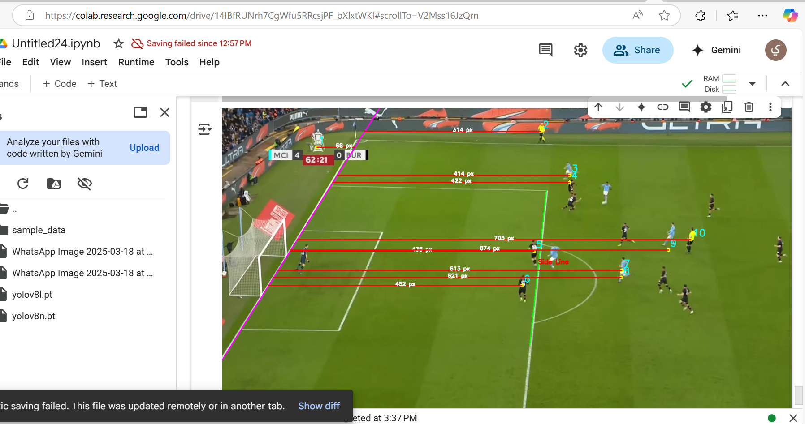

# ⚽ Offside Detection using Computer Vision

🎯 **المشكلة**: في مباريات كرة القدم، تحديد التسلل بدقة لحظية هو تحدي كبير للحكام. بعض الحالات تكون غير واضحة حتى في الإعادة.

👨‍💻 **الحل**: طورنا أداة تعتمد على الرؤية الحاسوبية لتحديد التسلل تلقائيًا، عبر حساب موقع اللاعبين نسبةً لخط نهاية الملعب، وتحديد اللاعب الأقرب لهذا الخط.

---

## 🧠 كيف يعمل النظام؟

نقوم بتحليل الصورة باستخدام خوارزميات OpenCV، ونتبع الخطوات التالية:

1. **كشف الخطوط**: نستخدم Canny وHough Transform لاكتشاف خطوط الملعب، ونركز على خط منطقة الجزاء (box line) أو خط نهاية الملعب كمرجع.
2. **كشف اللاعبين**: نعتمد على Haar Cascades لاكتشاف مواقع اللاعبين.
3. **تحديد أقرب لاعب**: نحسب المسافة العمودية بين كل لاعب والخط المرجعي.
4. **رسم النتائج**: نرسم كل لاعب مع الخط الواصل لأقرب نقطة على الخط، ونرتبهم حسب المسافة.

🔍 نعتبر أقرب لاعب إلى خط نهاية الملعب هو المؤثر الأساسي في تحديد التسلل.

---

## 🛠️ الأدوات المستخدمة

- Python
- OpenCV
- NumPy
- Google Colab (لتجربة سريعة)

---

## 🖼️ مثال من الإخراج

<p align="center">
  
</p>

---

## ⚙️ طريقة الاستخدام

1. ثبت المتطلبات:
   ```bash
   pip install -r requirements.txt

2. شغّل الكود من مجلد `src/`:
   ```bash
   python src/detect_offside.py


## 🎨 تصميم الواجهة (UI/UX)

يمكنك تصفح الواجهة كاملة عبر Figma:
🔗 [رابط التصميم على Figma](https://offside-vision-hub.lovable.app/)


🤝 فريق العمل
يوسف العبري
محمد اليامي
عبدالرحمن العجلان
عبدالرحمن سلامة

[]

